# 演示视频：<https://www.bilibili.com/video/av80406089/>

# 博客地址：https://blog.csdn.net/Excef/article/details/103674791


# 作业要求

1.  图片识别与建模
2. 虚拟按键小游戏

# 实现内容

​       **实验环境：unity2018.4.14f1**

​	本次是根据实验要求实现的一个简易AR程序。该程序能够识别指定的图片（如下）


并在图片上方生成1个AR虚拟按钮和1个蓝色方块，按下按钮方块会向指定位置（根据按按钮的次数）移动一段距离，松开按钮方块又回到初始位置。创建一个变量move，假定每次按下按钮都会导致move在1-4之间循环变动，则move的值域方块的移动方向可以表示为下图：

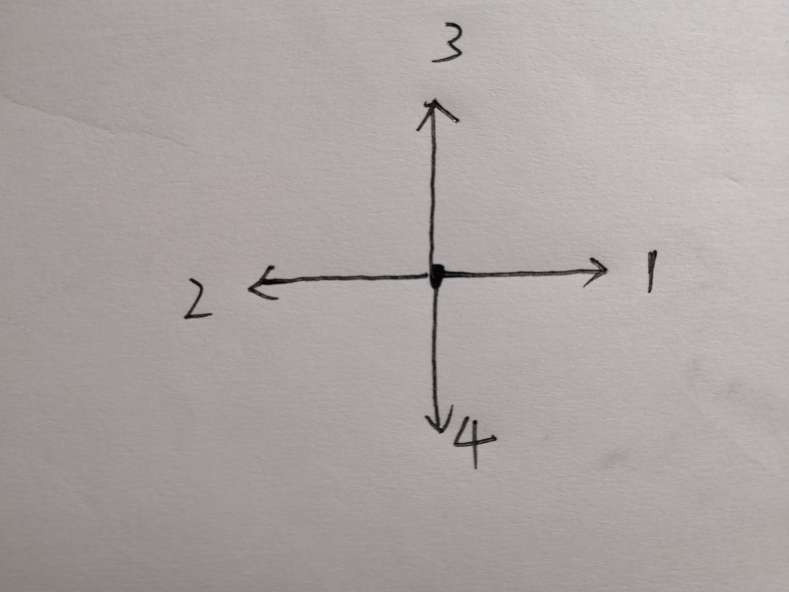

# 实验过程

## 1. 下载并使用Vuforia

在Vuforia官网（https://developer.vuforia.com/downloads/sdk ）注册账号，在Download页面下载相应的SDK安装到unity安装目录获取Vuforia支持

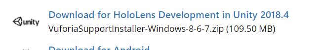

然后跳转到Develop页面，点击  **Get Development Key**：


输入name注册Licence Key:


注册完成后转到**Target Manager**,点击**Add Database**


输入数据库名，选择Device，点击**Create**创建数据库


创建完成后点击数据库，点击**Add Target**增加Target

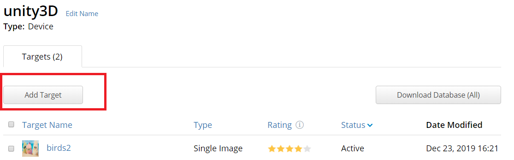

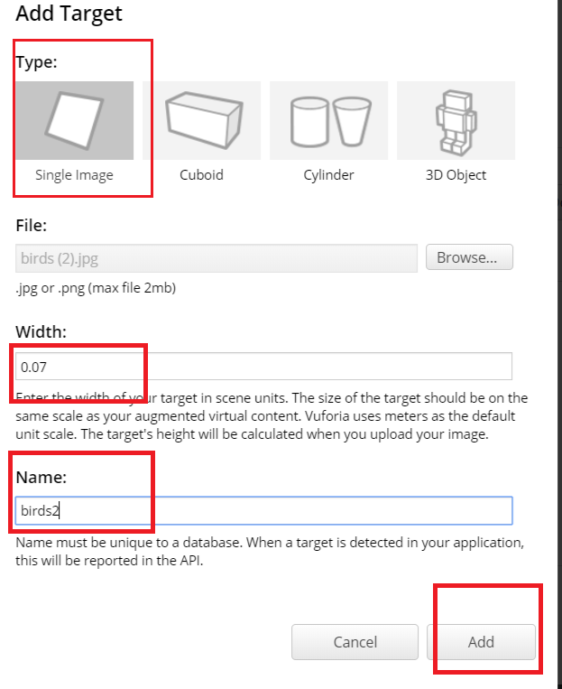

成功后可查看图片信息

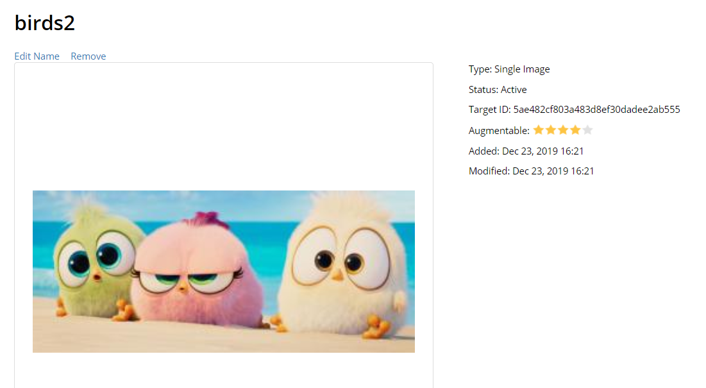

然后将创建好的数据库下载下来（unity package文件）。

## 2. 完成AR小程序

新建unity项目，file->buidl setting->player settings，在XR settings中勾选 Vuforia Augmented Reality。

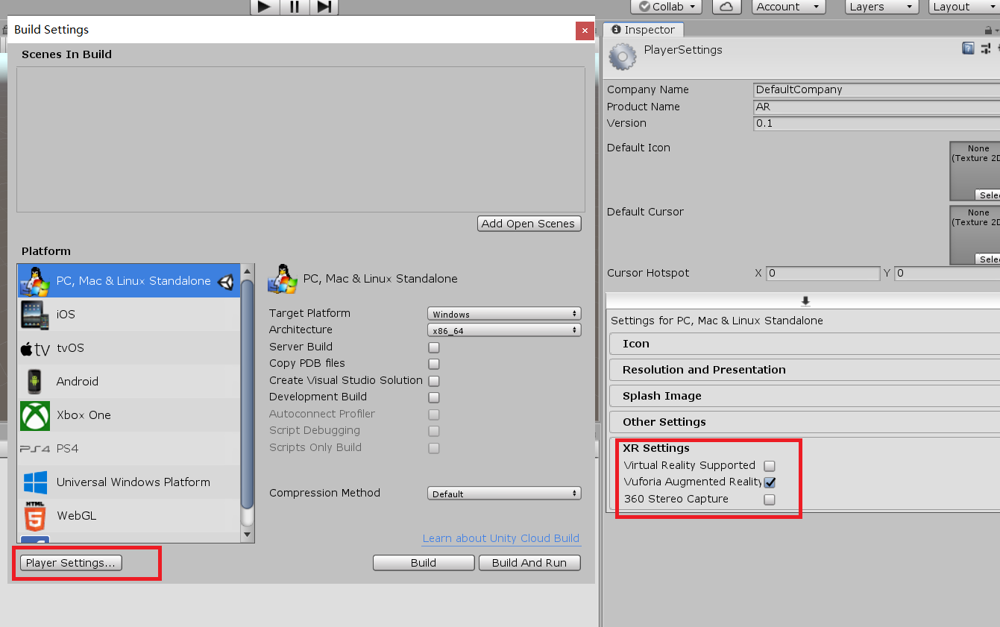

然后GameObject->Vuforia  Engine->AR Camera为项目增加AR Camera，并且删去原有的Main Camera。点击AR Camera，在Inspector面板中点击 Open Vuforia Engine Configuration

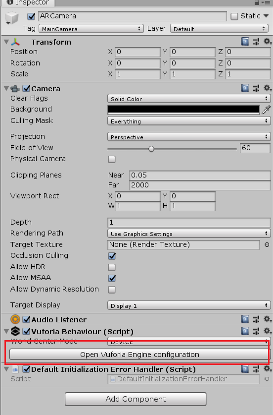

填入刚刚注册的Licence Key：

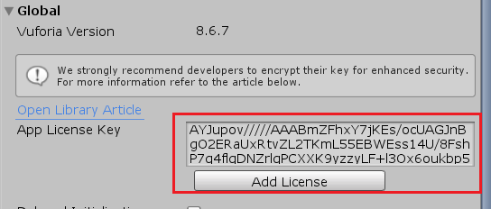

并且将刚刚下载的数据库文件导入到项目内：

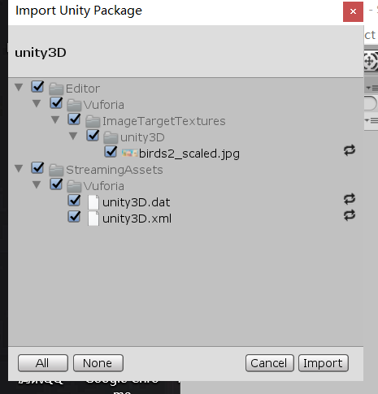

接着为项目增加一个Image Target：GameObject->Vuforia  Engine->Image(组件名称为image，但是增加后默认名称为Image Target)。


将Image Target Behaviour中Type设置为From Database,使用相应的数据库和Target

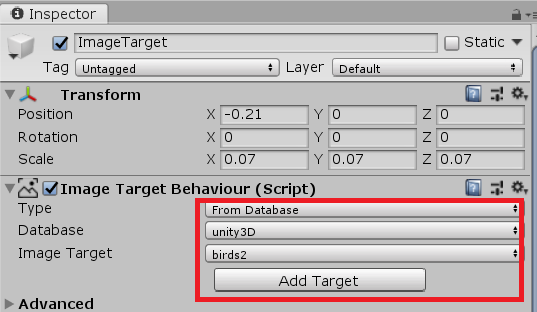

添加Virtual Button：点击ImageTarget，在Inspector面板中点击Advanced，展开后点击Add Virtual Button按钮，并且为Virtual Button添加一个大小相同位置相同的plane子对象。最后为Image Target添加一个Cube子对象作为移动的方块

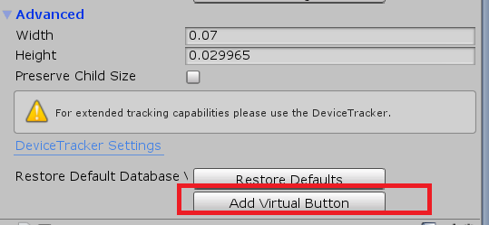

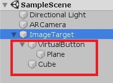

调节以上三个组件的位置和大小属性（主要是为了在点击按钮时方块的移动可以方便观察）：

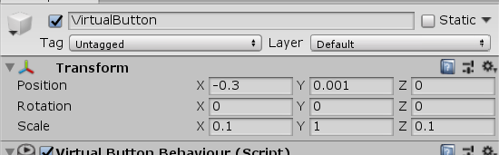

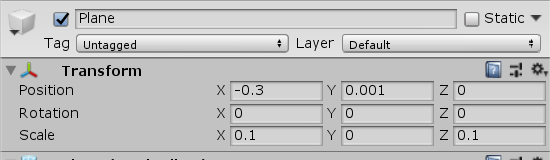


编写一个实现上述功能（点击按钮方块按四个方向规律移动）的脚本，挂载到Image Target上：

```c#
using System.Collections;
using System.Collections.Generic;
using UnityEngine;
using System;
using Vuforia;

public class ButtonEvent : MonoBehaviour, IVirtualButtonEventHandler
{
    public VirtualButtonBehaviour[] vbs;
    public GameObject cube;
    public GameObject button;
    public float move;
    public float moveback;
    public Vector3 Xdistance;
    public Vector3 Zdistance;
    //public float speed;

    void Start()
    {
        vbs = GetComponentsInChildren<VirtualButtonBehaviour>();
        for (int i = 0; i < vbs.Length; i++)
        {
            vbs[i].RegisterEventHandler(this);
        }
        move = 0.0f;
        moveback = 0.0f;
        //speed = 0.02f;
        Xdistance = new Vector3(0.02f,0.0f,0.0f);//X方向移动的距离
        Zdistance = new Vector3(0.0f,0.0f,0.02f);//Y当向上移动的距离
    }


    public void OnButtonPressed(VirtualButtonBehaviour vb)
    {
        //方块按规律朝4个方向移动
        move = move % 4.0f + 1.0f;
        Debug.Log("move");
        if(move == 1.0f){
        	cube.transform.Translate(move * Xdistance);
        }
        else  if(move == 2.0f){
        	cube.transform.Translate(move * Xdistance * (-1.0f));
        }
        else  if(move == 3.0f){
        	cube.transform.Translate(move * Zdistance);
        }else {
        	cube.transform.Translate(move * Zdistance * (-1.0f));
        }
    }

    public void OnButtonReleased(VirtualButtonBehaviour vb)
    {
        //方块恢复初始位置
        moveback = -1.0f * move; 
        Debug.Log("move back");
        if(move == 1.0f){
        	cube.transform.Translate(moveback * Xdistance);
        }
        else  if(move == 2.0f){
        	cube.transform.Translate(moveback * Xdistance * (-1.0f));
        }
        else  if(move == 3.0f){
        	cube.transform.Translate(moveback * Zdistance);
        }else {
        	cube.transform.Translate(moveback * Zdistance * (-1.0f));
        }
    }

    // void update(){
    	// Debug.Log("move");
    	// if(move == 1.0f){
    	// 	 float Xposition = cube.transform.position.y;
    	// 	if (Xposition <= 0.5f && Xposition >= 0.0f) {
	    //     	cube.transform.position += distance * Time.deltaTime;
	    //     }else {
	    //     	direction = (-1.0f )* direction;
	    //     	cube.transform.position += distance * Time.deltaTime;
	    //     }
    	// }
    //}
    
}


```

然后就实现了演示视频（https://www.bilibili.com/video/av80406089/） 里的效果了