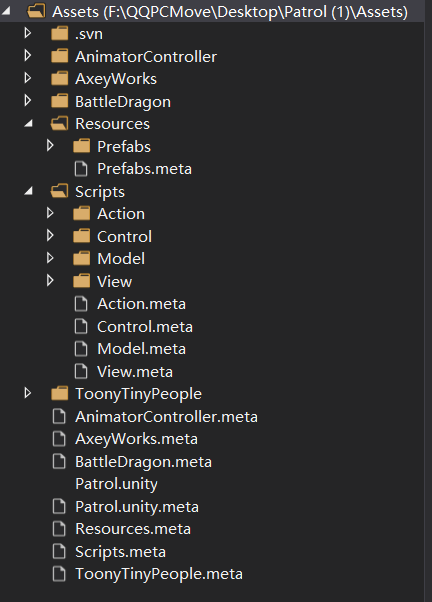
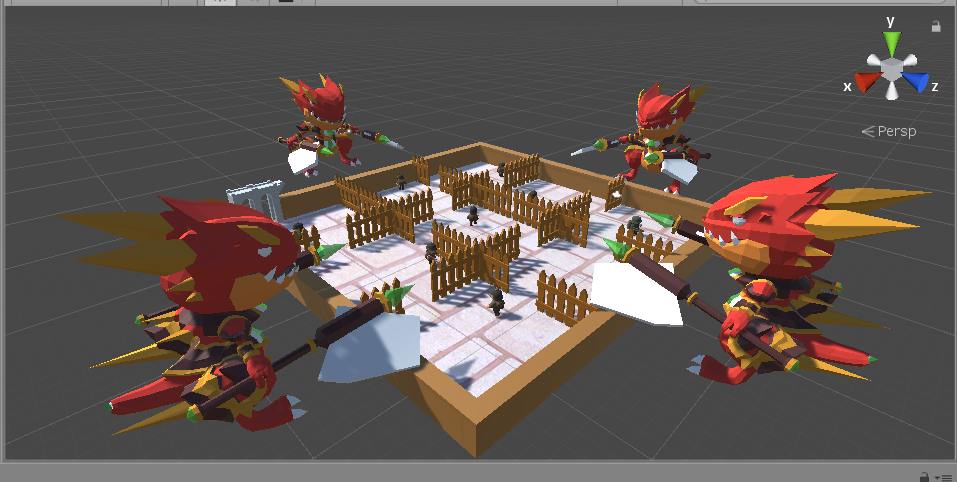

#### 演示视频：<<https://www.bilibili.com/video/av74229278/>

#### 项目内容： Patrol/Assets

#### 参考资料：<https://blog.csdn.net/c486c/article/details/80153548>

#### 总体结构：

本项目是参考师兄的博客做出的简化版，总体结构如下：

#### 运行截图：

游戏视角为第一人称，游戏角色活动范围是一个有9个区域的“囚笼”，囚笼外有4个巨大的战龙观看着玩家在囚笼内四处逃窜，情绪激动的摇晃着双斧，嘴里喊着“杀”（看嘴型脑补）。

或许可以设定一个简单的游戏背景：20XX年，外星殖民者侵略地球，凭借其野蛮而又难以抵御的巨大破坏力，地球成为了外形殖民者的殖民地，人类也自此成为了外星战龙饲养的玩物，受尽欺辱。主角Ender不甘受压迫，想要逃出外星人的魔爪，然而计划败露，落入龙手。为了惩罚Ender，杀鸡儆猴，外星人将Ender丢进了“囚笼”，还放入了8个饲养的人类，命令他们追杀Ender，Ender只能一直躲避追杀，到死为止（完了有点黑暗）。

