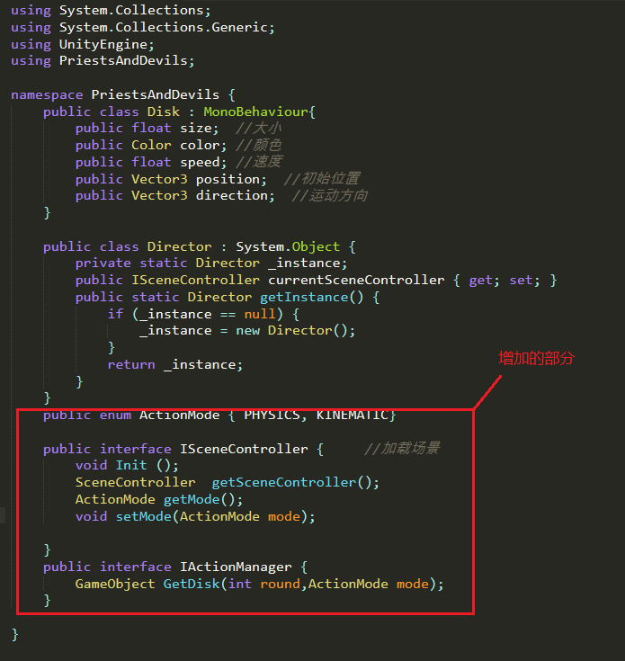

#### 演示视频：

<<https://www.bilibili.com/video/av74229278/>


##### 实验要求：

- 按如下设计图修改飞碟游戏
- 使它同时支持物理运动与运动学（变换）运动


#### 设计说明：

这一次是在作业5的基础上改进，总体结构并未有太大改变，只是按照要求修改了部分代码。

##### 总体结构：


其中DiskFactory.cs因为根据model而给出了飞碟的运动属性，所以改归入了Action部分。

在作业5中我们实现的游戏就是既给飞碟初速度，又给飞碟重力作用，现在我们要进行修改，将飞碟预制的Rigidbody组件删除。

作业6飞碟预制属性：


作业5飞碟预制属性：


修改BaseCode.cs。在作业5的基础上，增加一个mode，和一个根据mode控制飞碟飞行属性的接口IActionManager.



DiskFactory.cs新增实现IActionManager接口的功能，将原本设定的所有飞碟皆受重力作用给为仅当mode为PHYSICS时增加Rigidbody（必须保证预制没有添加Rigidbody,如果有则不能成功）和重力作用：

```go
using System.Collections;
using System.Collections.Generic;
using UnityEngine;
using PriestsAndDevils;
// 工厂模式
public class DiskFactory : MonoBehaviour, IActionManager
{
    private List<Disk> toDelete = new List<Disk>();
    private List<Disk> toUse = new List<Disk>();
    public Color[] colors = {Color.white,Color.yellow,Color.red,Color.blue,Color.green,Color.black};//可选颜色

   
    public GameObject GetDisk(int round,ActionMode mode){//根据回合数对飞碟设置属性并返回
        GameObject newDisk = null;
        if (toUse.Count > 0){
            newDisk = toUse[0].gameObject;
            toUse.Remove(toUse[0]);
        }else{
            newDisk = GameObject.Instantiate<GameObject>(Resources.Load<GameObject>("Prefabs/disk"), Vector3.zero, Quaternion.identity);
            newDisk.AddComponent<Disk>();
        }
        //commonProperities();
        if (mode == ActionMode.PHYSICS){//如果是PHYSICS模式，增加Rigidbody和重力作用
            newDisk.AddComponent<Rigidbody>();
            newDisk.GetComponent<Rigidbody>().AddForce(Vector3.down * 9.8f, ForceMode.Acceleration);
        }

          // 飞碟的速度为round*7
        newDisk.GetComponent<Disk>().speed = 7.0f * round;
        // 飞碟随round越来越小
        newDisk.GetComponent<Disk>().size = (1 - round*0.1f);
        // 飞碟颜色随机
        int color = UnityEngine.Random.Range(0, 6);//共有六种颜色
        newDisk.GetComponent<Disk>().color = colors[color];
       
        // 飞碟的发射方向
        float RanX = UnityEngine.Random.Range(-1, 3) < 1 ? -1 : 1;//-1，0则为负方向，1，2则为正方向
        newDisk.GetComponent<Disk>().direction = new Vector3(-RanX, UnityEngine.Random.Range(-2f, 2f), 0);
        // 飞碟的初始位置
        newDisk.GetComponent<Disk>().position = new Vector3(RanX*13, UnityEngine.Random.Range(-2f, 2f), UnityEngine.Random.Range(-1f, 1f));

        toDelete.Add(newDisk.GetComponent<Disk>());
        newDisk.SetActive(false);
        newDisk.name = newDisk.GetInstanceID().ToString();
        return newDisk;
    }

    public void FreeDisk(GameObject disk){
        Disk cycledDisk = null;
        foreach (Disk toCycle in toDelete){
            if (disk.GetInstanceID() == toCycle.gameObject.GetInstanceID()){
                cycledDisk = toCycle;
            }
        }
        if (cycledDisk != null){
            cycledDisk.gameObject.SetActive(false);
            toUse.Add(cycledDisk);
            toDelete.Remove(cycledDisk);
        }
    }

}
```

ActionManager.cs（没有改变）管理场景的动作：管理飞碟的运动以及与用户交互：每当有光标拾取到飞碟时，分数加一，飞碟消失。

```go
using System.Collections;
using System.Collections.Generic;
using UnityEngine;
using PriestsAndDevils;

public class ActionManager : MonoBehaviour
{

    public Vector3 direction;//运动方向
    public float speed;//初速度
    public GameObject cam;

    public void diskFly(Vector3 direction,float speed){//赋予飞碟初速度和方向
        this.direction = direction;
        this.speed = speed;
    }

    // Start is called before the first frame update
    void Start(){
        cam = GameObject.Find("Main Camera");
    }

    // Update is called once per frame
    void Update(){
        
        this.gameObject.transform.position += speed * direction * Time.deltaTime;

        if (Input.GetButtonDown("Fire1")){   //光标拾取物体的结果，即鼠标集中飞碟的结果
           
            Debug.Log("Fired Pressed");
            Debug.Log(Input.mousePosition);

            Vector3 mp = Input.mousePosition; //get Screen Position

            //create ray, origin is camera, and direction to mousepoint
            Camera ca;
            if (cam != null) ca = cam.GetComponent<Camera>();
            else ca = Camera.main;

            Ray ray = ca.ScreenPointToRay(Input.mousePosition);

            //Return the ray's hits
            RaycastHit[] hits = Physics.RaycastAll(ray);

            foreach (RaycastHit hit in hits){
                print(hit.transform.gameObject.name);
                if (hit.collider.gameObject.tag.Contains("Finish")){ //plane tag
                    Debug.Log("hit " + hit.collider.gameObject.name + "!");
                }
                Singleton<DiskFactory>.Instance.FreeDisk(hit.transform.gameObject);//飞碟消失
                //this.gameObject.GetComponent<UserGUI>().score ++;
                //SceneController.getInstance().addScore();
                Director.getInstance ().currentSceneController.getSceneController().addScore();//分数加一
            }
        }

    }
}
```

SceneController.cs（没有改变）作为场景控制器控制游戏的输出信息：回合数，总飞碟数，所得分数

```go
public class SceneController{
    
    public int round ;  //回合数
    public int total ;  //总飞碟数
    public int score ;//得到的分数

    private static SceneController sceneCtrl;

    public SceneController() {//用于SceneController归0
        score = 0;
        total = 0;
        score = 0;
    }
    public static SceneController getInstance(){
        if (sceneCtrl == null){
            sceneCtrl = new SceneController();
        }
        return sceneCtrl;
    }

    public void addRound(){
        round++;
    }
    public void addTotal(){
        total++;
    }
    public void addScore(){
        score++;
    }
    
    public int getRound(){
        return round;
    }
    public int getTotal() {
        return total;
    }
    public int getScore() {
        return score;
    }
}
```


FirstSceneController.cs增加mode作为成员变量，并将其传递给DiskFactory的GetDisk()函数生成所需的飞碟。

```go
using System.Collections;
using System.Collections.Generic;
using UnityEngine;
using PriestsAndDevils;


public class Singleton<T> : MonoBehaviour where T : MonoBehaviour
{
    protected static T instance;
    public static T Instance
    {
        get
        {
            if (instance == null)
            {
                instance = (T)FindObjectOfType(typeof(T));
                if (instance == null) {  
                    Debug.LogError ("An instance of " + typeof(T) +
                    " is needed in the scene, but there is none.");  
                }  
            }
            return instance;
        }
    }
}


public class FirstSceneController : MonoBehaviour, ISceneController{
    public int diskFlyTimes; //已经发射的飞碟个数，每回合10个，最多30个
    public float time;// 时间，用于控制飞碟发射间隔
    public int round;  // 当前回合数
    public ActionMode mode;//模式选择

    // 飞碟队列
    public Queue<GameObject> diskQueue = new Queue<GameObject>();//飞碟队列
    public SceneController  sceneCtrl;
    

    public ActionMode getMode() 
    {
        return mode; 
    }

    public void setMode(ActionMode m)
    {
        //if (m == ActionMode.KINEMATIC) this.gameObject.AddComponent<CCActionManager>();
    //    else this.gameObject.AddComponent<PhysicActionManager>();
        mode = m;
    }


    // Start is called before the first frame update
    void Start(){
        // 当前场景控制器
        Director.getInstance().currentSceneController = this;
        this.gameObject.AddComponent<DiskFactory>();
        this.gameObject.AddComponent<UserGUI>();
        Director.getInstance().currentSceneController.Init();//初始化FirstSceneController相关数据

        mode = ActionMode.PHYSICS;
    }

    // 初始化每个回合的飞碟队列,每个回合的飞碟属性不同
    void initQueue(){
        diskQueue.Clear();//clear first

        for(int i = 0;i < 10;i ++)
            diskQueue.Enqueue(Singleton<DiskFactory>.Instance.GetDisk(round,getMode()));
    }

    // Update is called once per frame
    void Update() {
       // round = sceneCtrl.getRound();
        time += Time.deltaTime;
        // 发射飞碟的间隔回合数成反比
        if(time >= 2.0f-0.3*round){

            if(diskFlyTimes >= 30){//游戏结束
                Reset();
            }else if ((diskFlyTimes % 10) == 0 ){//更新回合（此步骤必须在发射飞碟前面）
                round ++;//在initQueue();前面才行
                sceneCtrl.addRound();//回合数增加
                initQueue();//初始化新的飞盘队列
            }
            if (diskFlyTimes < 30){
                time = 0;
                ThrowDisk();//发射飞盘
                diskFlyTimes ++;//飞盘数增加
                sceneCtrl.addTotal();//综费盘数增加
            }
        }
    }

    public void ThrowDisk()
    {
        if(diskQueue.Count > 0)
        {
            GameObject disk = diskQueue.Dequeue();
            disk.GetComponent<Renderer>().material.color = disk.GetComponent<Disk>().color;
            disk.transform.position = disk.GetComponent<Disk>().position;
            disk.transform.localScale = disk.GetComponent<Disk>().size * disk.transform.localScale;
            disk.SetActive(true);
            disk.AddComponent<ActionManager>();
            disk.GetComponent<ActionManager>().diskFly(disk.GetComponent<Disk>().direction, disk.GetComponent<Disk>().speed);
        }
    }
    /*public int getRound(){
        return sceneCtrl.getRound();
    }
    public int getTotal(){
        return sceneCtrl.getTotal();
    }*/

    public void Init()
    {
        sceneCtrl = new SceneController();//SceneController元素归0
        diskFlyTimes = 0;
        time = 0;
        round = 0;
        diskQueue.Clear();//清空飞盘队列
    }
    public SceneController  getSceneController(){
        return sceneCtrl;
    }
    void Reset()
    {
        this.gameObject.GetComponent<UserGUI>().reset = 1;
    }

}
```

UserGUI.cs新增模式选择功能：

```go
using System.Collections;
using System.Collections.Generic;
using UnityEngine;
using PriestsAndDevils;

public class UserGUI : MonoBehaviour
{
    /*public int round;//直接在此定义使用时旧的数字不会消失
    public int total;
    public int score;*/
    public int reset;
    GUIStyle style;
	GUIStyle buttonStyle;
   // public ISceneController userAction;直接用可以运行，但是会报错
    // Start is called before the first frame update
    ActionMode mode;
    void Start()
    {
        reset = 0;//不能一开始就设定为1，否则需要按两下按钮才会消失
        style = new GUIStyle();
		style.fontSize = 30;
		//style.alignment = TextAnchor.MiddleCenter;
		style.normal.textColor = Color.green;// 

		buttonStyle = new GUIStyle("button");
		buttonStyle.fontSize = 15;
		buttonStyle.normal.textColor = Color.green;// 
        //userAction = Director.getInstance().currentSceneController;//此处挂载失败

        mode = ActionMode.PHYSICS;
    }

    // Update is called once per frame
    void Update()
    {
       
    }

    private void OnGUI()
    {
       
        if(reset == 1){
            /*if(GUI.Button(new Rect(380, 250, 100, 80), "Reset",buttonStyle)){
            	//userAction.Init();
                Director.getInstance().currentSceneController.Init();
                reset = 0;
            }*/
            
           if(GUI.Button(new Rect(200, 250, 100, 80), "KINEMATIC",buttonStyle)){
                mode = ActionMode.KINEMATIC;
                Director.getInstance().currentSceneController.setMode(mode);
                Director.getInstance().currentSceneController.Init();
                reset = 0;
                return;
            }
            if(GUI.Button(new Rect(400, 250, 100, 80), "PHYSICS",buttonStyle)){
                mode = ActionMode.PHYSICS;
                Director.getInstance().currentSceneController.setMode(mode);
                Director.getInstance().currentSceneController.Init();
                reset = 0;
                return;
            } 
           // else mode = ActionMode.PHYSICS;
            
            
        }

        if (reset == 0){
           
            int round = Director.getInstance().currentSceneController.getSceneController().getRound();
            int total = Director.getInstance().currentSceneController.getSceneController().getTotal();
            int score = Director.getInstance().currentSceneController.getSceneController().getScore();
            int miss = total - score;//未击中的飞碟数
            //string text = "Round: " + userAction.getSceneController().GetRound().ToString() + "\nTotal:  " + total.ToString() + "\nScores:  " + score.ToString();
            string text = "Round: " + round.ToString() + "\nMiss:  " + miss.ToString() + "\nScores:  " + score.ToString();
            GUI.Label(new Rect(10, 10, Screen.width, 50),text,style); 

        }     
    }

}
```
