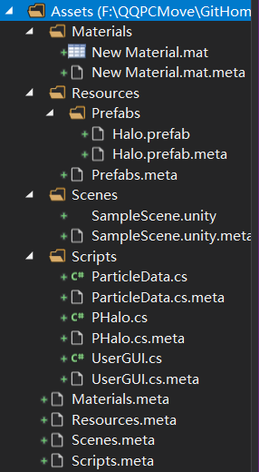
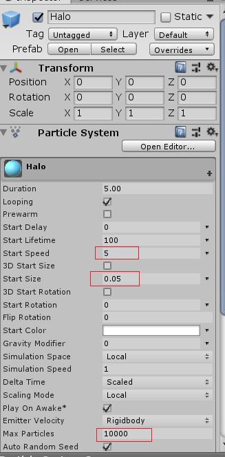
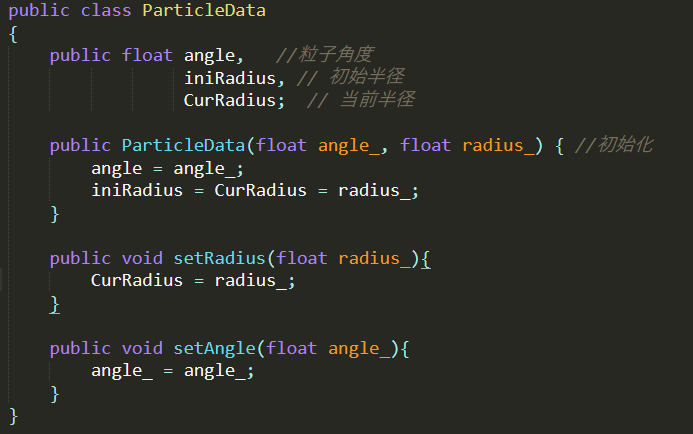
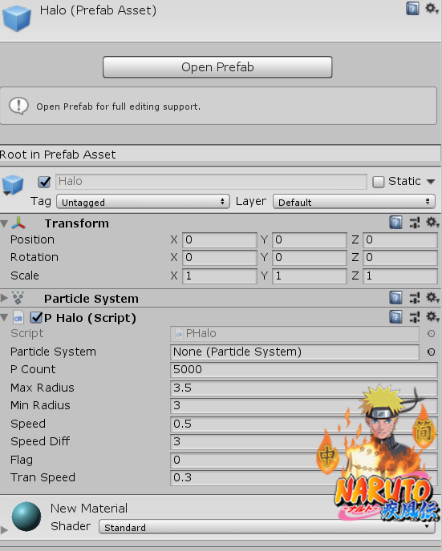
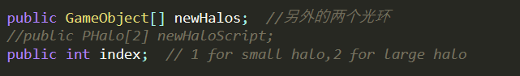

#### 演示视频：https://www.bilibili.com/video/av75083030/>

#### 项目代码：

#### 效果演示：


##### 实验要求：

- 本次作业基本要求是**三选一**

  1、简单粒子制作

  - 按参考资源要求，制作一个粒子系统，[参考资源](http://www.cnblogs.com/CaomaoUnity3d/p/5983730.html)
  - 使用 3.3 节介绍，用代码控制使之在不同场景下效果不一样

  2、完善官方的“汽车尾气”模拟

  - 使用官方资源资源 Vehicle 的 car， 使用 Smoke 粒子系统模拟启动发动、运行、故障等场景效果

  3、参考 http://i-remember.fr/en 这类网站，使用粒子流编程控制制作一些效果， 如“粒子光环”

  - 可参考以前作业

- 所选内容：3——粒子光环

#### 设计说明：

##### 总体结构：

本次作业比较简单，结构也相对简单。



Materials中是粒子的颜色Material,Prefabs是一个不带UserGUI.cs脚本的光环预置，Scene中的是游戏场景，Script中是（3个）脚本

##### 设计流程：

创建一个空对象Halo，添加ParticleSystem组件，修改部分属性值：



新建脚本ParticleData.cs，创建类ParticleData，储存（一个）粒子的属性信息：



创建脚本PHalo.cs，实现粒子光环：

- 定义粒子系统变量及粒子运动相关变量

  ```c#
  	public ParticleSystem particleSystem; 
  	private ParticleSystem.Particle[] particles; //粒子数组
      private ParticleData[] pDatas;   //粒子属性数组
  
      //public Camera camera;
      public int pCount = 5000; // 粒子数目
      public float maxRadius = 3.5f; // 原始最大半径
      public float minRadius = 3f;  // 原始最小半径
      public float speed = 0.5f;    //粒子运动速度
      public float speedDiff = 3; //速度差分值
  
      public int flag;   //用以辨别粒子光环是否需要改变大小
      					//0则表示需要回到初始大小，1则表示将光环变小，2表示变大
      public float tranSpeed = 1f;    //光环大小变化时粒子的变化速度
  
  ```

  其中flag是一个比较重要的函数，可以通过flag的值及对应光环（光环不止一个）位置确定光环是否需要改变位置

- 增加一个改变flag的函数，以改变光环的位置

  ```c#
   public void SetFlag(int flag_){
      	flag = flag_;
      }
  ```

- 变量初始化及光环粒子初始化

  ```c#
  void Start()
      {
      	//数据初始化
          particleSystem = this.GetComponent<ParticleSystem>();
          particles = new ParticleSystem.Particle[pCount];
          pDatas = new ParticleData[pCount]; 
                  
          particleSystem.maxParticles = pCount;
      	particleSystem.Emit(pCount);
          particleSystem.GetParticles(particles);
  
          flag = 0;
  
          ///for (int i = 0; i < 4  ; i++)
         // {
              //将光环分为3部分，第一部分宽度占1/4，第二部分也占1/4，第三部分占1/2
              float radius,angle,midRadius1,midRadius2;
              midRadius1 = minRadius + (maxRadius - minRadius)/4;
              midRadius2 = maxRadius + (maxRadius - minRadius)/2;
              
              //给三部分的粒子赋予初始值，第一部分的离子数占1/10
              for (int j = 0 ; j < pCount/10 ; j ++){
              	angle = Random.Range(0.0f, 360.0f);
              	radius = Random.Range(minRadius, midRadius1);
              	pDatas[j] = new ParticleData(angle,radius);
              }
              //第二部分的离子数占4/5
              for (int j = 0 ; j < 4 * pCount/5 ; j ++){
              	angle = Random.Range(0.0f, 360.0f);
              	radius = Random.Range(midRadius1, midRadius2);
              	pDatas[pCount/10 + j] = new ParticleData(angle,radius);
              }
              //第三部分的离子数占1/10
              for (int j = 0 ; j < pCount/10 ; j ++){
              	angle = Random.Range(0.0f, 360.0f);
              	radius = Random.Range(midRadius2, maxRadius);
              	pDatas[9 * pCount/10 + j] = new ParticleData(angle,radius);
              }
             
          }
      //}
  ```

  

- 根据flag确定粒子运动形式

  ```c#
  void Update()
      {
          
          for (int i = 0 ; i < pCount ; i++){
          	
          	if (flag == 1){ //光环半径变为初始值的0.6，是一个渐变过程
          		if (pDatas[i].CurRadius > (0.6f * pDatas[i].iniRadius)){
          			pDatas[i].CurRadius -= tranSpeed * Time.deltaTime;
          		}
          	}else if (flag == 2){ //光环半径变为初始值的1.6，是一个渐变过程
          		if (pDatas[i].CurRadius < (1.6f * pDatas[i].iniRadius)){
          			pDatas[i].CurRadius += tranSpeed * Time.deltaTime;
          		}
          	}
          	else if (flag == 0){ //光环半径渐变为初始大小
          		if (pDatas[i].CurRadius > pDatas[i].iniRadius){
          			pDatas[i].CurRadius -= tranSpeed * Time.deltaTime;
          		}
          		if (pDatas[i].CurRadius < pDatas[i].iniRadius){
          			pDatas[i].CurRadius += tranSpeed * Time.deltaTime;
          		}
          	}
          	
          	float angle_ = pDatas[i].angle;
          	// 一半的粒子顺时针旋转，一半的粒子逆时针旋转 
              if (i % 2 == 0){   
                  angle_  += ((i % speedDiff + 1) * speed) % 360;  
              } else{  
                  angle_  -= ((i % speedDiff + 1) * speed) % 360;  
              }  
              pDatas[i].angle = angle_;
  
              // 更新坐标
              float rad = pDatas[i].angle / 180 * Mathf.PI; 
              particles[i].position = new Vector3(pDatas[i].CurRadius * Mathf.Cos(rad), pDatas[i].CurRadius * Mathf.Sin(rad), 0f);  
          }
  
          particleSystem.SetParticles(particles, pCount);       
      }
  ```

  

将PHalo.cs挂载到空对象Halo上，将得到的Halo作为预制（本身仍保留）：



新建UserGUI.cs，使得玩家可通过点击按钮改变光环的形态：

- 定义相关变量

  

  ​	newHalos里将会通过加载预制存储另外两个光环；

  ​	index用来确定这两个光环是否需要通过变换改变位置：

  ​		index = 1，newHalos[0]半径逐渐减小到Halo的0.6；

  ​		index = 2，newHalos[1]半径逐渐增大到Halo的1.6；

  ​		index = 0，则两个光环都逐渐回到Halo初始位置；

- 变量初始化

  ```c#
  void Start()
  {
          //newHalos = new GameObject[2];
          index = 0;
          Reset();//重置加载两个光环
  
  }
  
  void Reset(){  //重置加载两个光环（即与初始光环重合）
      	//newHalos[0].Clear(newHalos,0,1);
  
      	newHalos = new GameObject[2];
      	//加载光环预置
      	newHalos[0] = GameObject.Instantiate<GameObject>(Resources.Load<GameObject>("Prefabs/Halo"), Vector3.zero, Quaternion.identity);
          newHalos[1] = GameObject.Instantiate<GameObject>(Resources.Load<GameObject>("Prefabs/Halo"), Vector3.zero, Quaternion.identity);
  }
  ```

- 确定交互形式

  ​	根据index的值，确定newHalos的两个光环的变换形式，并且改变flag的值以使得光环逐渐改变运动形态。

  ```c#
  void OnGUI()
  {
      if (GUI.Button(new Rect(0, 80, 80, 60), "Reset"))
    	{
          Reset();//重置
      }
      if (GUI.Button(new Rect(0, 160, 80, 60), "Split"))  //光环分离或重合
      {
          Split();
      }
  }
  void Split(){//与初始光环分离或重合
      	index = (index + 1) % 3;//取值0，1，2
      	if (index == 0){//如果index为0，则光环全部回到初始位置
      		newHalos[0].GetComponent<PHalo>().SetFlag(index);
      		newHalos[1].GetComponent<PHalo>().SetFlag(index);
      	}else{//否则两个光环之中的一个分离
      		newHalos[index - 1].GetComponent<PHalo>().SetFlag(index);
      	} 
      	Debug.Log("
                    index:"+index);
   }
  ```

将UserGUI.cs挂载到空对象Halo上（预制Halo上不需要，否则会出现毒哦额GUI重合，造成功能异常），这样在游戏加载完成后就会有一个较为浓密的光环在屏幕中间（其实是3个光环在同一位置）。第一次点击Split后会有一个较小的光环从中逐渐分离出来，直到半径为初始光环的0.6；再次点击Split后，又会有另外一个较大的光环从初始光环中分离出来，半径为初始光环的1.6；第三次点击后最大的光环和最小的光环都将逐渐回到初始位置，以此循环。Reset则将使得光环瞬间恢复到初始状态。

